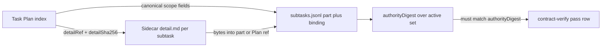

# ACDD roadmap

Shipped behavior lives in [README.md](README.md) and [DESIGN.md](DESIGN.md).
This file tracks **planned** core changes that are not in the schema yet.

## Shipped (recent)

- **Contract freeze banner:** successful `acdd validate` (and Contract `finalize`)
  print a non-fatal **ACDD FREEZE** warning while `contract/v1` is `pass`
  (`acdd.hints`).
- **Agent policy:** until finalize, edit the **same** Plan subtask after verify;
  propose splits — do not invent `*-r2` clones. After finalize, only
  `acdd contract-subtask` + re-verify. Documented in gate skills, AGENTS, DESIGN.

## Next: subtask sidecars, status, and verified

Goal: stop stuffing long writes/matrices into the task body; keep a compact Plan
index in the task; put per-subtask detail in adapter-owned files; mark slices
machine-verified after `contract-verify`.

### Existing machine freeze (keep)

On Contract finalize the task adapter already writes one append-only bundle:

`<artifactDir>/<bundle-id>.subtasks.jsonl`

Each current subtask: **part** + **binding** (`partSha256`, scope digest,
Contract fingerprint). `contract-subtask` appends; it never rewrites earlier
rows. Evidence JSONL and transcripts stay under `artifacts/` as today.

### Digests

| Digest | Covers | When it moves |
| --- | --- | --- |
| `detailSha256` | One sidecar file bytes | That file changes |
| `partSha256` / binding | One frozen subtask part | Part rewrite forbidden; append successor |
| **`authorityDigest`** | All **active** (non-superseded) Plan subtasks | Addition or replacement changes the set |

After adding a subtask, **`authorityDigest` recalculates**. No third whole-package
hash. Verify evidence must carry the matching digest (already required when
Contract has a review check).

### One verify, not two

One full `contract-verify` on the new authority set (new slice **and** fit with
siblings: completeness, chain-coverage, proof-strength, parallel-safety).

Flow: `contract-subtask` → full verify → evidence with `authorityDigest` →
validate green. Host UX may highlight the new id; the terminal remains one
package pass.

### Per-subtask `status` + `verified`

Today `Subtask` has no status field. Gate Receipts
(`pending|partial|blocked|pass|inapplicable`) apply to the **whole task** only.
“Verified” is only implied by package verify evidence + JSONL parts after
finalize.

**Target schema** (Plan index and/or sidecar frontmatter):

| Field | Meaning |
| --- | --- |
| `status` | Slice lifecycle, e.g. `draft` → `ready` → `in_build` → `done` (exact enum at impl) |
| `verified` | `false` until `contract-verify` accepts the package that includes this subtask; then **`verified: true`** |

**Who sets `verified: true`:** ACDD/host **script** after a successful
`contract-verify` record (same moment as `authorityDigest` on evidence) — not
agent prose. Editing that subtask before the next pass clears `verified` (or
`validate` rejects a stale `true`). After Contract finalize, frozen verified
slices stay true; a `supersedes` successor starts `verified: false` until its
own verify pass.

`verified: true` is the machine marker that edit-in-place of that slice’s
contract fields requires `contract-subtask` (aligned with today’s part freeze).

### What lives where

**In the task markdown**

- Compact prose (objective, boundaries, checklists)
- **Plan index** per subtask: `id`, short `acceptance`, `dependsOn` /
  `supersedes`, `status`, `verified`, `detailRef`, `detailSha256`, plus the
  minimal fields the part still hashes
- Inputs as **directory roots** (not encyclopedic file lists)
- Evidence / Receipts as refs + digests only

**In sidecar Markdown** (one file per subtask), e.g.
`.acdd/current/<task-stem>/<subtask-id>.md`:

- Full `writes` / `reads`
- Matrix rows for that slice
- Invariants, forbidden effects, owner notes
- RED entrypoint note (body stays in the implementation-repo test file)

**Unchanged**

- Evidence JSONL, verify transcripts, `*.subtasks.jsonl` under
  `.acdd/artifacts/`

Format: Markdown for human/agent detail; JSONL remains the machine freeze
ledger.

### Per-check phased appearance

| Gate / check | In task | In sidecar / artifacts |
| --- | --- | --- |
| `design/v1` design-basis | Outcome, boundaries, non-goals | — |
| `design/v1` plan-shape | Draft Plan index + Input roots | Optional draft sidecars, unhashed until Contract |
| `contract/v1` decomposition | Plan index complete; each `detailRef` exists | Sidecar bodies authored |
| `contract/v1` executable-proof | Proof entrypoint in frontmatter | Matrix + scope detail in sidecar; RED body in test file |
| `contract/v1` contract-verify | Package = index + sidecars + live paths | Pass stamps `authorityDigest`; script sets `verified: true` on included active subtasks |
| finalize Contract | Receipt + Evidence refs | Append `*.subtasks.jsonl`; freeze `detailSha256` |
| later `contract-subtask` | Append Plan index row | New sidecar; append JSONL part; recompute `authorityDigest`; full re-verify |
| `build/v1` | No contract prose edits | Implement inside active writes |
| `review/v1` / `handoff/v1` | Receipts / blockers | Zip `.acdd/current/<task-stem>/` → `.acdd/archive/<phase>/<task-stem>.zip`, remove current |

Adapter owns `artifactDir`, `currentDir`, `archiveDir` (names locked at impl).
Core validates digests; adapter/handoff owns file lifecycle.

### Host execution index (consumer repos)

Where a host keeps an “active task” board (e.g. a current-execution doc), the
adapter should write a **stable ref** (task path, session, current gate,
Contract fingerprint, `authorityDigest`, optional `currentDir` / failed-verify
artifact) — not wave novels. Detail stays in the task, sidecars, and artifacts.

### Migration

Moving body into sidecars / adding `detailRef` **changes fingerprints and
authority** for any in-flight Contract-pass task.

1. **Defer** cutover until no active Contract-pass task needs the old shape, or
2. **One-time clearcut:** explicit approval → rewrite Plan to refs → recompute
   digests → full `contract-verify` + re-finalize.

Do not hand-preserve hashes without a migrate tool that proves extracted content
equivalence.

### Out of scope until cutover

- Shipping `detailRef` / sidecar schema in core
- Per-subtask `status` / `verified` in the parser
- Adapter `currentDir` / `archiveDir`
- Host execution-index format migration
- Rewriting in-flight consumer tasks mid-gate
