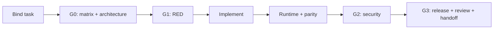

# Getting Started with ACDD

ACDD makes the intended architecture and its proof explicit before code changes.
Use it when passing unit tests alone would not prove the real caller, authority
boundary, backend behavior, or release safety.

## Small walkthrough

Assume a task adds a field to an API response.

1. Bind the task and owner adapters.
2. In G0, identify the response owner, serializer, callers, storage path,
   compatibility impact, and proof IDs. Run the adapter-owned architecture
   command: one preflight, four read-only inspectors, then one coordinator.
   Obtain independent architecture PASS before implementation.
3. In RED, run the smallest test that fails because the field is absent.
4. Implement only the approved contract.
5. Prove the real API caller. Run parity if multiple backends or public forms
   exist, then run applicable security negatives.
6. Run the repository release command and independent closure review.
7. Record current receipts and close only with no blockers.

Validate the bound document with the explicit command from
[INSTALL.md](../INSTALL.md). Copy a runnable task shape from
[examples/task/TASK.md](../examples/task/TASK.md).

## Why the gates exist

| Gate | Failure it prevents |
|---|---|
| `matrix/v1` | A serializer, caller, backend, or deployment owner is silently omitted. |
| `architecture/v1` | Implementation starts from an incorrect owner or incomplete production path. |
| `red/v1` | A passing test is mistaken for proof that the requested gap existed. |
| `runtime/v1` | A helper works while the real caller remains broken. |
| `parity/v1` | One applicable implementation, generated surface, or alternate path works while another fails. |
| `security/v1` | Authorization, tenant, payload, or external-effect failures are missed. |
| `release/v1` | Focused tests pass while the repository gate fails. |
| `review/v1` | The author closes work without independent challenge. |
| `handoff/v1` | Stale receipts or unresolved blockers are hidden at closure. |
